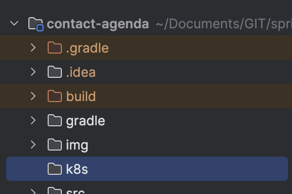
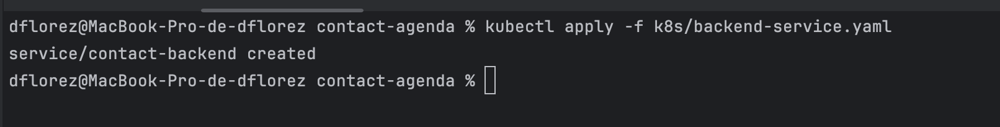
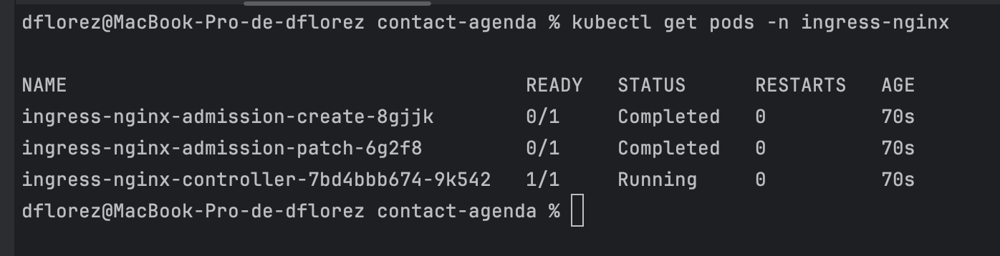
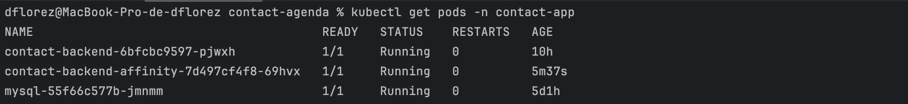
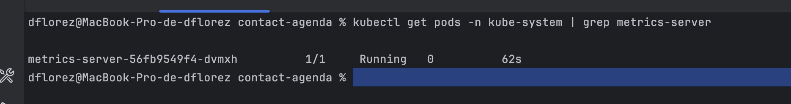

# Práctica 13. Despliegue de microservicios profesionalmente en K8s

## Objetivo: 
Al finalizar la práctica, serás capaz de: 
- Implementar almacenamiento persistente en Kubernetes utilizando Persistent Volumes (PV) y Persistent Volume Claims (PVC), validando su creación, vinculación con pods y persistencia de datos después de reinicios o eliminación de contenedores.

## Duración aproximada: 
- 150 minutos.

---

**[⬅️ Atrás](https://netec-mx.github.io/CUSTOM_NETEC_DOCK_KUB_Priv/Capitulo12/)** | **[Lista general](https://netec-mx.github.io/CUSTOM_NETEC_DOCK_KUB_Priv/)**

---

## Instrucciones:
### Tarea 1. Crear artefactos de la aplicación

Para crear el artefacto del _backend_, ejecuta el siguiente comando en la terminal:

```bash
 ./gradlew clean build
```


Para verificar que se ha creado el artefacto, revisa la carpeta `build/libs` del proyecto. Debería aparecer un archivo con el nombre **`contact-agenda-0.0.1-SNAPSHOT.jar`**.


### Tarea 2. Dockerizando el backend.

**Paso 1.** Crear el archivo DockerFile.

a. Haz clic derecho en la carpeta del proyecto y crea un archivo llamado `Dockerfile`.


b. Escribe el siguiente contenido en el archivo `Dockerfile`:

```dockerfile
# Imagen base recomendada para Java 17 en producción/K8s
FROM eclipse-temurin:17-jdk-alpine

# Crea el directorio de trabajo
WORKDIR /app

# Copia el artefacto jar generado por Gradle
COPY build/libs/contact-agenda-0.0.1-SNAPSHOT.jar app.jar

# Expone el puerto del backend
EXPOSE 8080

# Comando de inicio
ENTRYPOINT ["java", "-jar", "app.jar"]
```

c. Crea la imagen basada en el Dockerfile.

```bash
 docker build -t contact-agenda-backend .
```


d. Crea el contenedor a partir de la imagen que generaste:

```bash
 docker run -p 8080:8080 contact-agenda-backend
```


e. Valida en la siguiente URL si se desplegó correctamente: [http://localhost:8080/swagger-ui/index.html#/API%20contact/create](http://localhost:8080/swagger-ui/index.html#/API%20contact/create])


### Tarea 3. Habilitar Kubernetes en Docker Desktop

a. Abre Docker Desktop y dirígete a la sección **Settings** (Configuración).


b. En la pestaña Kubernetes, activa la opción **Enable Kubernetes** (Habilitar Kubernetes).


c. Haz clic en **Apply & Restart** (Aplicar y reiniciar) para aplicar los cambios y reiniciar Docker Desktop.


d. Una vez que Docker Desktop se haya reiniciado, verifica que Kubernetes esté funcionando correctamente. Debería aparecer un mensaje indicando que Kubernetes está activo.


e. Para confirmar que Kubernetes está funcionando correctamente, abre una terminal y ejecuta el siguiente comando:

```bash
kubectl cluster-info
```

Deberías ver información sobre el clúster de Kubernetes, incluyendo la dirección del servidor de la API y otros detalles.


### Tarea 4. Configurar Kubernetes para el proyecto

a. Crea la carpeta `k8s` en la raíz del proyecto.



b. Crea el archivo `namespace.yaml` con el siguiente contenido:

```yaml
apiVersion: v1
kind: Namespace
metadata:
  name: contact-app
```


c. Crea el namespace ejecutando el siguiente comando en la terminal:

```bash
kubectl apply -f k8s/namespace.yaml
```


d. Verifica que el _namespace_ se haya creado correctamente:

```bash
kubectl get namespaces
```


e. Ahora crearás el _Secret_, que te permite almacenar de forma segura las credenciales de la base de datos. Crea el archivo `secret.yaml` con el siguiente contenido:

```yaml
apiVersion: v1
kind: Secret
metadata:
  name: mysql-secret
  namespace: contact-app
type: Opaque
data:
  mysql-root-password: bmV0ZWN0MTIz
```


f. Crea el _Secret_ ejecutando el siguiente comando en la terminal:

```bash
kubectl apply -f k8s/secret.yaml
```


g. Verificar que el _Secret_ se haya creado correctamente:

```bash
kubectl get secrets -n contact-app
```


*💡 **Nota:** Las variables en el Secret deben estar codificadas en base64. Para codificar una variable, puedes usar el siguiente comando en la terminal:*

```bash
echo -n 'valor' | base64
```

### Tarea 5. Creación y persistencia de base de datos MySQL (volumen persistente + Deployment para MySQL)

a. Crea el archivo `mysql-volume.yaml` para garantizar que tu base de datos no pierda datos si el contenedor se reinicia.

```yaml
apiVersion: v1
kind: PersistentVolumeClaim
metadata:
  name: mysql-pvc
  namespace: contact-app
spec:
  accessModes:
    - ReadWriteOnce
  resources:
    requests:
      storage: 1Gi
```


b. Para crear el _Deployment_ de MySQL, genera el archivo `mysql-deployment.yaml` con el siguiente contenido:

```yaml
apiVersion: apps/v1
kind: Deployment
metadata:
  name: mysql
  namespace: contact-app
  labels:
    app: mysql
spec:
  replicas: 1
  selector:
    matchLabels:
      app: mysql
  template:
    metadata:
      labels:
        app: mysql
    spec:
      containers:
        - name: mysql
          image: mysql:5.7
          imagePullPolicy: IfNotPresent
          env:
            - name: MYSQL_ROOT_PASSWORD
              valueFrom:
                secretKeyRef:
                  name: mysql-secret
                  key: mysql-root-password
          ports:
            - containerPort: 3306
          volumeMounts:
            - name: mysql-storage
              mountPath: /var/lib/mysql
      volumes:
        - name: mysql-storage
          persistentVolumeClaim:
            claimName: mysql-pvc
```


c. Crear el _Service_ para exponer MySQL internamente dentro de Kubernetes. Crea el archivo `mysql-service.yaml` con el siguiente contenido:

```yaml
apiVersion: v1
kind: Service
metadata:
  name: mysql
  namespace: contact-app
spec:
  selector:
    app: mysql
  ports:
    - protocol: TCP
      port: 3306
      targetPort: 3306
  type: ClusterIP
```


d. Crea el volumen persistente ejecutando el siguiente comando en la terminal:

```bash
kubectl apply -f k8s/mysql-volume.yaml
```


e. Crea el _Deployment_ de MySQL ejecutando el siguiente comando en la terminal:

```bash
kubectl apply -f k8s/mysql-deployment.yaml
```


f. Crear el _Service_ de MySQL ejecutando el siguiente comando en la terminal:

```bash
kubectl apply -f k8s/mysql-service.yaml
```


g. Verifica que el _Deployment_ de MySQL se haya creado correctamente:

```bash
kubectl get pods -n contact-app
```


h. Verifica que el **svc** de MySQL se haya creado correctamente:

```bash
kubectl get svc -n contact-app
```


i. Para poder conectarnos conectarte a la base de datos con DBever, ejecuta el siguiente comando en la terminal:

```bash
kubectl port-forward svc/mysql 3306:3306 -n contact-app
```


j. Abre DBeaver y crea una nueva conexión MySQL con los siguientes datos:


k. Crea la base de datos `db-contact` en la base de datos:


### Tarea 6. Desplegar el backend (Spring Boot) en Kubernetes

a. Debes ajustar el archivo application.yaml del backend para que se conecte a la base de datos MySQL. Asegúrate de que tenga la siguiente configuración:

 - La URL debe quedar de la siguiente manera:

   ```
   url: jdbc:mysql://mysql-service:3306/db-contact
   ```

 - Ajusta la contraseña como una variable:

   ```
   password: ${MYSQL_PASSWORD:netect123}
   ```

```yaml
server:
   port: 8080
spring:
   datasource:
      url: jdbc:mysql://mysql:3306/db-contact?useSSL=false&serverTimezone=UTC
      username: root
      password: ${MYSQL_PASSWORD:netect123}
      driver-class-name: com.mysql.cj.jdbc.Driver

   jpa:
      hibernate:
         ddl-auto: update
      show-sql: true
      properties:
         hibernate:
            dialect: org.hibernate.dialect.MySQL8Dialect
springdoc:
   api-docs:
      path: /api-docs
   show-actuator: false
   packages-to-scan: com.netec.contact.agenda.controller
```


b. Crea el artefacto del backend con el siguiente comando:

```bash
./gradlew clean build -x test
```


c. Crea la imagen de Docker del backend ejecutando el siguiente comando en la terminal:

```bash
docker build -t contact-agenda-backend:latest .
```


d. Verifica que la imagen de Docker del backend se haya creado correctamente:

```bash
docker images | grep contact-agenda-backend
```


e. Se creará el _Deployment_ para el backend. Crea el archivo `backend-deployment.yaml` con el siguiente contenido:

```yaml
apiVersion: apps/v1
kind: Deployment
metadata:
   name: contact-backend
   namespace: contact-app
spec:
   replicas: 1
   selector:
      matchLabels:
         app: contact-backend
   template:
      metadata:
         labels:
            app: contact-backend
      spec:
         containers:
            - name: contact-backend
              image: contact-agenda-backend:latest
              imagePullPolicy: Never
              ports:
                 - containerPort: 8080
              env:
                 - name: MYSQL_PASSWORD
                   valueFrom:
                      secretKeyRef:
                         name: mysql-secret
                         key: mysql-root-password
```


f. Crea en la carpeta `k8s` el archivo `backend-service.yaml` con el siguiente contenido para exponer el backend:

```yaml
apiVersion: v1
kind: Service
metadata:
  name: contact-backend
  namespace: contact-app
spec:
  selector:
    app: contact-backend
  ports:
    - port: 8080
      targetPort: 8080
  type: ClusterIP
```


g. Crea el _Deployment_ del backend ejecutando el siguiente comando en la terminal:

```bash
kubectl apply -f k8s/backend-deployment.yaml
```


h. Crea el _Service_ del backend ejecutando el siguiente comando en la terminal:

```bash
kubectl apply -f k8s/backend-service.yaml
```


i. Verifica que el _Deployment_ del backend se haya creado correctamente:

```bash
kubectl get pods -n contact-app
```


j. Verifica que el _Service_ del backend se haya creado correctamente:

kubectl logs -f <pod-name> -n contact-app

```bash
kubectl logs -f contact-backend-6bfcbc9597-pjwxh -n contact-app
```


k. Para acceder al backend desde el navegador, se debe hacer un port-forward del Service del backend. Ejecuta el siguiente comando en la terminal:

```bash
 kubectl port-forward svc/contact-backend 8080:8080 -n contact-app
```


l. Abre el navegador y accedr a la siguiente URL para verificar que el backend esté funcionando correctamente 'http://localhost:8080/swagger-ui/index.html'.


### Tarea 7. Configurar Ingress para el backend.

a. Instala el controlador de Ingress NGINX en Kubernetes. Ejecuta el siguiente comando en la terminal:

```bash
kubectl apply -f https://raw.githubusercontent.com/kubernetes/ingress-nginx/controller-v1.10.1/deploy/static/provider/cloud/deploy.yaml
```


b. Verifica que el controlador de Ingress NGINX se haya instalado correctamente:

```bash
kubectl get pods -n ingress-nginx
```



c. Crea el archivo `ingress.yaml` en la carpeta `k8s` con el siguiente contenido para configurar _Ingress_:

```yaml
apiVersion: networking.k8s.io/v1
kind: Ingress
metadata:
  name: contact-ingress
  namespace: contact-app
  annotations:
    nginx.ingress.kubernetes.io/rewrite-target: /
spec:
  ingressClassName: nginx
  rules:
    - host: contact.local
      http:
        paths:
          - path: /
            pathType: Prefix
            backend:
              service:
                name: contact-backend
                port:
                  number: 8080
```


d. Crea el _Ingress_ ejecutando el siguiente comando en la terminal:

```bash
kubectl apply -f k8s/ingress.yaml
```


e. Verifica que el _Ingress_ se haya creado correctamente:

```bash
kubectl get ingress -n contact-app
```


f. Para acceder al backend a través de Ingress, se debe agregar una entrada en el archivo `hosts` del sistema operativo. Abre el archivo `/etc/hosts` (en Linux y macOS) o `C:\Windows\System32\drivers\etc\hosts` (en Windows) y agrega la siguiente línea:

```
sudo nano /etc/hosts
```

Se agrega esta línea al final del archivo:

```
127.0.0.1 contact.local
```


g. Abre el navegador y accede a la siguiente URL para verificar que el backend esté funcionando correctamente a través de Ingress:

```
http://contact.local/swagger-ui/index.html
```


### Tarea 8. Implementando Node Affinity.

a. Lista los nodos disponibles en el clúster de Kubernetes:

```bash
kubectl get nodes
```


b. Define una etiqueta personalizada para identificar el nodo como válido para `contact-backend`.

```bash
kubectl label nodes docker-desktop node-type=backend
```

Este comando asigna la etiqueta `node-type=backend` a tu único nodo (docker-desktop). Es útil cuando tengas más de un nodo y quieras controlar en cuál se ejecuta el backend.


c. Confirmar que la etiqueta se aplicó correctamente

```bash
kubectl get nodes --show-labels
```


d. Crea un archivo `node-affinity.yaml` en la carpeta `k8s` con el siguiente contenido para implementar Node Affinity:

```yaml
apiVersion: apps/v1
kind: Deployment
metadata:
  name: contact-backend-affinity
  namespace: contact-app
spec:
  replicas: 1
  selector:
    matchLabels:
      app: contact-backend-affinity
  template:
    metadata:
      labels:
        app: contact-backend-affinity
    spec:
      affinity:
        nodeAffinity:
          requiredDuringSchedulingIgnoredDuringExecution:
            nodeSelectorTerms:
              - matchExpressions:
                  - key: node-type
                    operator: In
                    values:
                      - backend
      containers:
        - name: contact-backend
          image: contact-agenda-backend:latest
          imagePullPolicy: Never
          ports:
            - containerPort: 8080
          env:
            - name: MYSQL_PASSWORD
              valueFrom:
                secretKeyRef:
                  name: mysql-secret
                  key: mysql-root-password
```


e. Crea el _Deployment_ con Node Affinity ejecutando el siguiente comando en la terminal:

```bash
kubectl apply -f k8s/node-affinity.yaml
```


f. Verifica que el _Deployment_ con Node Affinity se haya creado correctamente:

```bash
kubectl get pods -n contact-app -o wide
```


g. Lista los pods para verificar que el pod contact-backend-affinity se esté ejecutando en el nodo con la etiqueta node-type=backend:

```bash
kubectl get pods -n contact-app
```



h. Observa el log del pod con Node Affinity para verificar que se esté ejecutando correctamente:

```bash
 kubectl logs -f contact-backend-affinity-7d497cf4f8-69hvx -n contact-app
```


💡 **Nota:** <br>
Al aplicar Node Affinity, le estamos diciendo a Kubernetes que este pod solo debe ejecutarse en nodos con ciertas características (en este caso, con la etiqueta node-type=backend). Aunque ahora solo tenemos un nodo, esta práctica es muy útil en entornos con múltiples nodos, ya que nos permite organizar mejor nuestras cargas de trabajo, aprovechar mejor los recursos y asegurar estabilidad.

### Tarea 9. Aplicar monitoreo y Troubleshooting.

Es importante monitorear el estado de los pods y servicios en Kubernetes para asegurarse de que todo esté funcionando correctamente. Aquí hay algunos comandos útiles para monitorear y solucionar problemas:

 * Detectar errores antes de que impacten.
 * Ahorrar tiempo identificando la causa raíz de fallas.
 * Diagnosticar problemas de red, fallos de pods, o errores de configuración.

a. Instala el componente `metrics-server` para monitorear el uso de recursos de los pods y nodos:

```bash
kubectl apply -f https://github.com/kubernetes-sigs/metrics-server/releases/latest/download/components.yaml
```


b. Verifica que el `metrics-server` se haya instalado correctamente:

```bash
kubectl get pods -n kube-system | grep metrics-server
```

c. Puede tardar un par de minutos en estar disponible, Si la salida es 0/1 seguir los siguientes pasos:


d. Agrega `--kubelet-insecure-tls` para esto se debe modificar el _Deployment_ del metrics-server. Para esto, ejecuta el siguiente comando en la terminal:

```bash
kubectl edit deployment metrics-server -n kube-system
```


e. En la sección `spec.template.spec.containers[0].args`, agrega esta línea:

- --kubelet-insecure-tls


f. Guarda y cierra el editor. Esto actualizará el _Deployment_ del `metrics-server` y aplica los cambios del nuevo archivo.


g. Verifica nuevamente que el `metrics-server` esté funcionando correctamente:

```bash
kubectl get pods -n kube-system | grep metrics-server
```



h. Verifica el uso de recursos de los pods en el namespace contact-app:

```bash
kubectl top nodes
kubectl top pods -n contact-app
```


### Tarea 10. Comandos clave de Troubleshooting.

a. Verifica el estado de todos los recursos del namespace.

```bash
kubectl get pods -n contact-app
```


b. Ver eventos recientes del clúster como Fallos, reinicios , errores de sheduling, etc.

```bash
kubectl get events -n contact-app
```


c. vamos a listar los pods para aplicar Troubleshooting

```bash
kubectl get pods -n contact-app
```


d.  Ver detalle de un pod para ver eventos recientes como errores de inicio, reinicios o volumenes usamos el comando describe

```bash
kubectl describe pod contact-backend-6bfcbc9597-pjwxh -n contact-app
```


e. Ver los logs de un pod para ver errores de la aplicación o problemas de inicio:

```bash
kubectl logs contact-backend-6bfcbc9597-pjwxh -n contact-app
```


f. Para ingresar al pod con un shell interactivo y depurar problemas en tiempo real:

```bash
kubectl exec -it contact-backend-affinity-7d497cf4f8-69hvx -n contact-app -- /bin/sh
```


